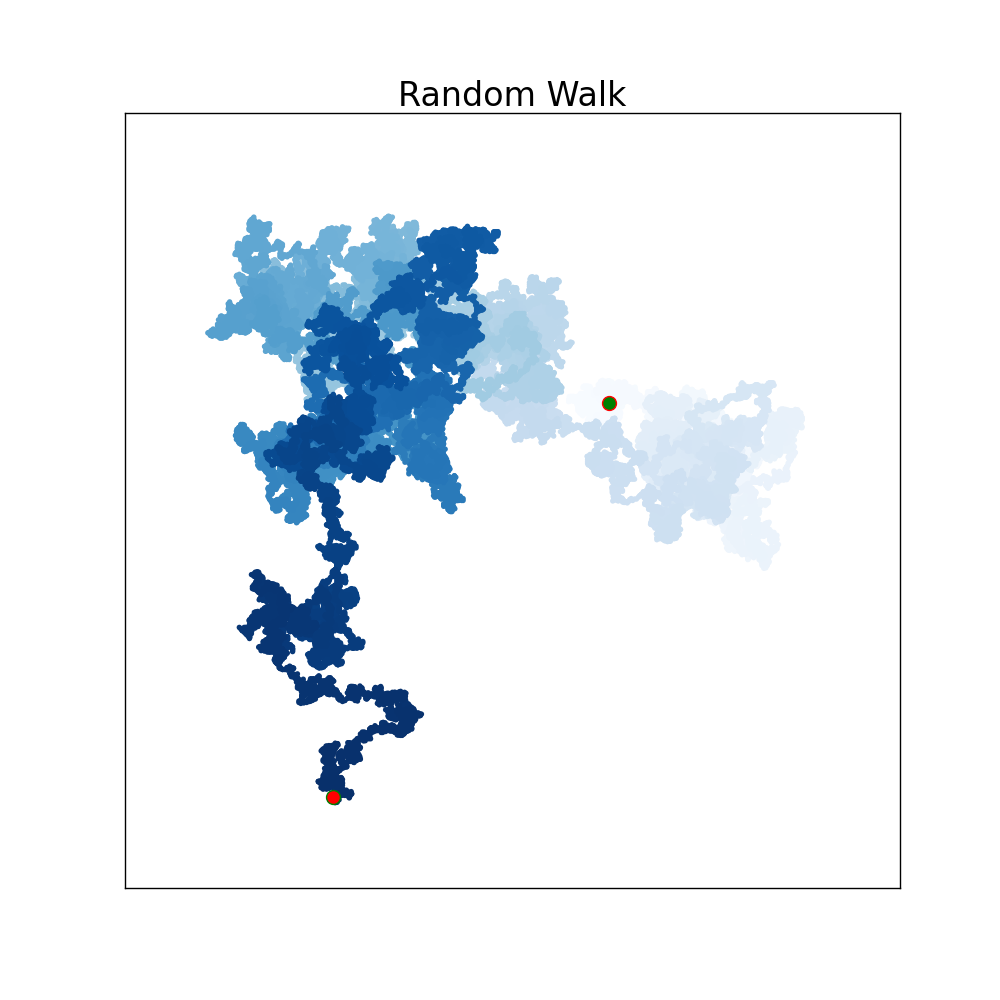
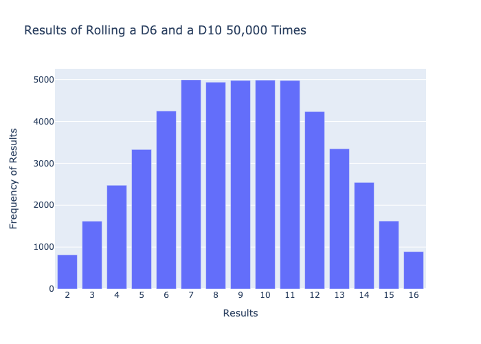
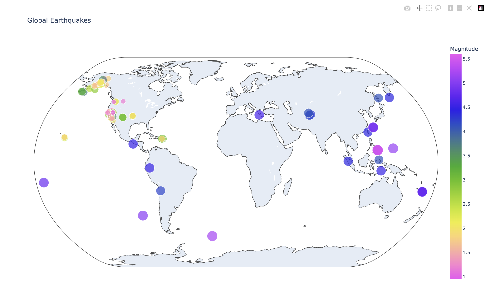
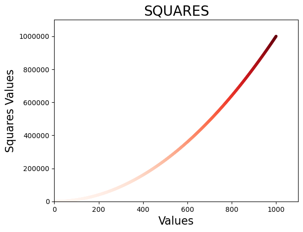

# Data Visualization Using Python

This repository contains four small projects focused on data visualization using Python. Each project demonstrates different visualization techniques using libraries such as Matplotlib and Plotly.

## Projects

### 1. Random Walk Visualization
- **Files:** **`random_walk.py`, `rw_visual.py`, `rw_visual.png`**
- **Description:** This project generates and visualizes random walks using Matplotlib. It simulates random movements and plots the path. Random walks are often used in simulations and modeling natural processes such as stock price movements and particle diffusion.
- **Libraries Used:** Matplotlib
- **How to Use:** Run the script to generate a new random walk visualization. The graph will show a path with random steps, illustrating how objects move in unpredictable ways.


### 2. Dice Roll Simulation
- **Files:** **`dice_visual_d6d10.py`, `dice_visual_d6d10.png`**
- **Description:** This project simulates rolling two different dice (D6 and D10) multiple times and visualizes the results as a histogram. The program helps in understanding probability distributions and randomness.
- **Libraries Used:** Matplotlib, Random
- **How to Use:** Execute the script to roll the dice a set number of times. The results are displayed as a histogram, showing the frequency of different sums appearing.



### 3. Earthquake Data Mapping
- **Files:** **`eq_world_map.py`, `eq_data/`, `Earthquake.png`**
- **Description:** This project uses real-world earthquake data to plot an interactive world map showing earthquake locations and magnitudes. The data is pulled from JSON files and visualized using Plotly, making it easy to analyze global earthquake activity.
- **Libraries Used:** Plotly, JSON
- **How to Use:** Run the script to generate an interactive map. The map will show earthquake locations, and clicking on markers will reveal more information about each event.



### 4. Weather Data Visualization
- **Files:** **`death_valley_highs_lows.py`, `weather_data/`**
- **Description:** This project reads and visualizes weather data trends, focusing on temperature variations. It provides insights into historical weather patterns and extreme temperature occurrences.
- **Libraries Used:** Matplotlib, CSV
- **How to Use:** Execute the script to read and plot temperature variations over time. The graph highlights daily high and low temperatures, helping to identify weather trends.





## Installation and Usage
To run any of the projects, ensure you have Python installed along with the required libraries:
```sh
pip install matplotlib plotly
```
Then, navigate to the respective directory and execute the script.
```sh
python script_name.py
```

---
This repository serves as a great introduction to data visualization using Python, showcasing different real-world applications. Happy coding!
